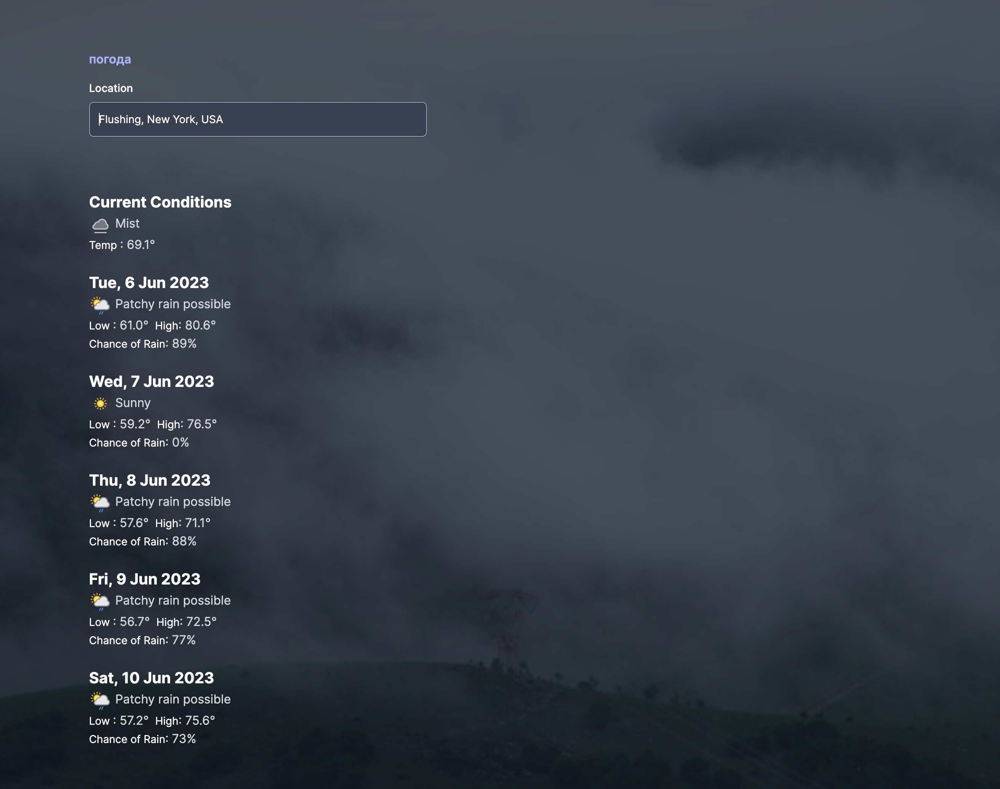
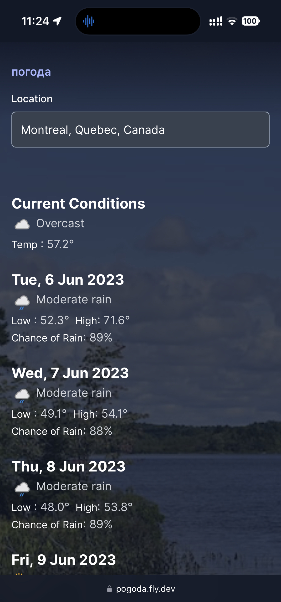

# погода

## Dependencies

- Ruby 3
- Rails 7
- PostgreSQL
- Redis

## Installation

To install base requirements with [ASDF][]:

```shell
asdf install
```

To install required dependencies and prepare the database:

```shell
bin/setup
```

## Development

To start the development server using foreman, issue `bin/dev` and navigate to
[http://127.0.0.1:3000](http://127.0.0.1:3000):

```shell
bin/dev
```

## Screenshots






[asdf]: https://github.com/asdf-vm/asdf
